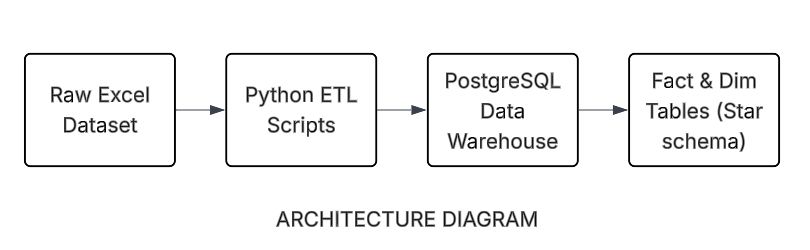

# AWS Batch ETL Pipeline for Retail Analytics

## 📌 Project Overview
This project implements a **batch ETL (Extract, Transform, Load) pipeline** to process real-world retail transaction data and model it into **analytics-ready fact and dimension tables**.  
The pipeline ingests raw transactional data, applies data cleaning and transformations using Python and SQL, and loads the curated data into a PostgreSQL data warehouse to support analytical queries.

The goal of this project is to demonstrate core **data engineering skills**, including data modeling, ETL development, and warehouse design, using an AWS-inspired architecture.

---

## 🎯 Problem Statement
Retail organizations generate large volumes of transactional data that are often stored in raw, unstructured formats.  
This raw data is not optimized for analytics, reporting, or business decision-making.

The objective of this project is to:
- Convert raw transactional data into a **structured analytical data model**
- Enable efficient querying for common business metrics such as revenue, customer behavior, and product performance
- Build a scalable and maintainable ETL pipeline following data engineering best practices

---

## 🏗️ Architecture
The pipeline follows a standard **batch data processing architecture**:

### Key Components:
- **Data Source**: Public retail transaction dataset (Excel format)
- **Processing Layer**: Python (Pandas) for ingestion, cleaning, and transformation
- **Storage / Warehouse**: PostgreSQL
- **Data Model**: Star schema with fact and dimension tables optimized for analytics

---

## 🧩 Data Model
The transformed data is organized using a **star schema**:

### Fact Table
- `fact_sales`: Stores transactional metrics such as quantity and revenue at the grain of *one product per invoice*.

### Dimension Tables
- `dim_customers`: Customer-level attributes
- `dim_products`: Product-level attributes
- `dim_date`: Date-level attributes for time-based analysis

This model supports efficient aggregation and analytical queries.

---

## 📂 Dataset Description
The dataset used in this project is the **Online Retail Transactions dataset** from the UCI Machine Learning Repository.

### Dataset Details:
- **Source**: UCI Machine Learning Repository
- **Domain**: E-commerce / Retail
- **Format**: Excel
- **Records**: ~500,000 transactions
- **Time Period**: 2010–2011

### Key Columns:
- `InvoiceNo`: Transaction identifier
- `StockCode`: Product identifier
- `Description`: Product description
- `Quantity`: Number of items purchased
- `InvoiceDate`: Transaction timestamp
- `UnitPrice`: Price per unit
- `CustomerID`: Customer identifier (nullable)
- `Country`: Customer country

### Data Quality Challenges:
- Missing customer identifiers
- Negative quantities indicating returns or cancellations
- Inconsistent product descriptions
- Date and numeric type normalization

Handling these challenges is a core part of the ETL process and reflects real-world data engineering scenarios.

---

## 🚀 Future Enhancements
- Add orchestration using Apache Airflow
- Implement ELT transformations using dbt
- Add incremental loading and data quality tests
- Extend the pipeline to cloud-native warehouses

---

## 🛠️ Tech Stack
- Python (Pandas)
- SQL
- PostgreSQL
- AWS S3 (optional raw data storage)

---

## 👤 Author
Krishna

